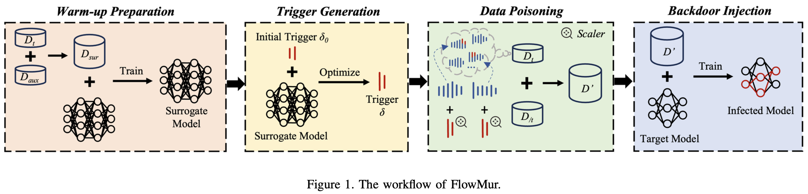

# Source code of FlowMur
Jiahe Lan, Jie Wang, Baochen Yan, Zheng Yan and Elisa Bertino, "[FlowMur: A Stealthy and Practical Audio Backdoor Attack with Limited Knowledge](https://www.computer.org/csdl/proceedings-article/sp/2024/313000a148/1Ub245RZpo4)," IEEE S&P, 2024.
## The workflow of FlowMur
<div align="center">
    
</div>

## How to start
```shell
This example is for the following setting:
dataset --> Google Speech Command Dataset V2
target model --> SmallCNN；surrogate model --> LargeCNN
#class of D --> 10; #class of D_aux --> 25
```
### Step 1: Data Preprocessing
Extract audio features of D and Daux respectively.
```shell
python data_preprocessing.py
```
## Comments
If you have any questions about the code, please feel free to ask here or contact me via email at <jhlan16@stu.xidian.edu.cn>.
